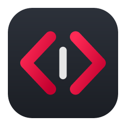
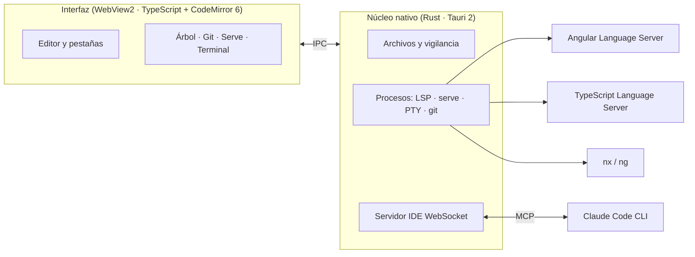

<div align="center">



# Editor Angular

**Un editor de código ultraligero, hecho exclusivamente para proyectos Angular y Nx.**

Arranca al instante, entiende tus plantillas, se integra con Claude Code y Git,
y no carga nada que no estés usando.


[Instalación](#-instalación) ·
[Funciones](#-funciones) ·
[Atajos](#-atajos-de-teclado) ·
[Claude Code](#-claude-code) ·
[Git](#-git) ·
[Rendimiento](#-rendimiento) ·
[Desarrollo](#-desarrollo) ·
[Problemas frecuentes](#-problemas-frecuentes)

</div>

---

## 📦 Instalación

### Requisitos

| Necesitas | Para qué | Cómo comprobarlo |
|---|---|---|
| **Windows 10 u 11** (64 bits) | Sistema soportado | — |
| **[Node.js 22+](https://nodejs.org)** | Ejecutar los servidores de Angular y TypeScript | `node --version` |
| **Git** *(opcional)* | Panel de control de versiones | `git --version` |
| **[Claude Code](https://claude.com/claude-code)** *(opcional)* | Integración con Claude | `claude --version` |

> [!NOTE]
> WebView2 (el motor que dibuja la interfaz) ya viene con Windows 10/11.
> Si faltara, el instalador lo descarga solo.

### Opción A — Instalador (recomendado)

1. Genera el instalador (ver [Compilar el instalador](#compilar-el-instalador)) u obtén
   `Editor Angular_0.1.0_x64-setup.exe` de quien lo haya compilado.
2. Ejecútalo. Se instala **solo para tu usuario**, sin pedir permisos de administrador.
3. Ábrelo desde el menú Inicio: **Editor Angular**.
4. Pulsa **`Ctrl+O`** y elige la carpeta de tu proyecto (la raíz del workspace, donde
   están `angular.json` o `nx.json`).

> [!TIP]
> Si tu proyecto usa **pnpm** o **yarn**, asegúrate de haber instalado sus dependencias
> (`pnpm install`) para que funcionen `nx generate`, `nx serve` y el servidor de Angular
> con la versión exacta de tu proyecto.

### Opción B — Desde el código

```powershell
git clone https://github.com/dewinsonbusiness/angular-editor.git
cd angular-editor
npm install          # también instala los servidores de lenguaje en lsp-servers/
npm run tauri dev    # abre el editor en modo desarrollo
```

Para esto necesitas además las [herramientas de compilación](#requisitos-para-compilar).

---

## ✨ Funciones

### Edición

- 🎨 **Resaltado de plantillas Angular**: control flow (`@if`, `@for`), bindings, pipes,
  además de TypeScript, SCSS/Sass, CSS y JSON.
- 🗂️ **Pestañas** que recuerdan su historial de deshacer y la posición del cursor.
- 💾 **Guardado manual o automático** (tras un retraso, al cambiar de foco o de ventana),
  configurable con `Ctrl+,`. Respeta los finales de línea CRLF/LF de cada archivo.
- 🔁 **Sesión por proyecto**: al reabrir, vuelven tus pestañas y el cursor donde estaba.
- 📚 **Dependencias en solo lectura**: lo que abres de `node_modules` (al ir a una
  definición) usa una única pestaña de vista previa que se reutiliza y no se guarda en la
  sesión. Doble clic en la pestaña para fijarla.

### Inteligencia de código

Con el **Angular Language Service** y **TypeScript** (los mismos motores que usa VS Code):

- ❌ Errores en vivo en plantillas y en `.ts`, marcados también en pestañas y árbol.
- 💡 Autocompletado, información al pasar el ratón y ayuda de firmas.
- 🧭 Ir a la definición (`F12` / `Ctrl+clic`), incluidas rutas como `templateUrl: './x.html'`.
- 🔎 Buscar referencias (`Shift+F12`) y **renombrar en todo el proyecto** (`F2`), también
  en archivos que no tienes abiertos.
- 🧹 Formatear documento (`Shift+Alt+F`).

### Proyecto

- 🌳 **Árbol de archivos** con iconos por tipo (componentes, servicios, guards, pipes,
  rutas, tests, Nx, npm…), que se despliega solo hasta el archivo activo.
- ➕ Crear, renombrar y eliminar (a la **papelera**, recuperable) desde el menú contextual.
- 👀 **Detecta cambios hechos fuera** del editor: el árbol se actualiza y las pestañas se
  recargan solas (o te avisa si tenías cambios sin guardar).
- ⚡ `Ctrl+P` ir a archivo · `Ctrl+Shift+F` buscar en todo el proyecto (respeta `.gitignore`).
- 🔀 `Alt+O` alterna entre el `.ts`, `.html` y `.scss` de un componente.

### Angular CLI y Nx

- 🏗️ **"Angular: generar"** en el menú contextual de cualquier carpeta: componente,
  servicio, directiva, pipe, guard, interceptor, resolver, interface, enum y clase.
  - Detecta el workspace hacia arriba: **Nx** (`nx.json` / `project.json`) o **Angular CLI**
    (`angular.json`), y usa el `nx`/`ng` instalado en tu proyecto.
- ▶️ **Panel de serve** (`Ctrl+J`): arranca `nx serve` / `ng serve` de cualquier app, varias
  a la vez, con los errores de compilación enlazados al archivo y la línea.

### Terminal, Claude Code y Git

- 🖥️ **Terminal integrada** (`Ctrl+Ñ`), varias pestañas, copiar/pegar con `Ctrl+C`/`Ctrl+V`.
- ✳️ **[Claude Code](#-claude-code)** conectado al editor como en VS Code.
- ⎇ **[Git](#-git)**: rama, colores en el árbol, marcas en el margen, commit, push y pull.

---

## ⌨️ Atajos de teclado

| Atajo | Acción | | Atajo | Acción |
|---|---|---|---|---|
| `Ctrl+O` | Abrir proyecto | | `F12` / `Ctrl+clic` | Ir a la definición |
| `Ctrl+P` | Ir a archivo | | `Shift+F12` | Buscar referencias |
| `Ctrl+Shift+F` | Buscar en el proyecto | | `F2` | Renombrar símbolo |
| `Ctrl+S` | Guardar | | `Shift+Alt+F` | Formatear |
| `Ctrl+K` `S` | Guardar todo | | `Ctrl+Espacio` | Autocompletar |
| `Ctrl+W` | Cerrar pestaña | | `Alt+O` | Alternar `.ts` / `.html` / `.scss` |
| `Ctrl+Tab` | Siguiente pestaña | | `Alt+clic` | Añadir cursor |
| `Ctrl+J` | Mostrar/ocultar panel | | `Ctrl+Ñ` | Mostrar/ocultar terminal |
| `Ctrl+Alt+K` | Enviar selección a Claude | | `Ctrl+,` | Configuración |
| `Tab` tras código · `Alt+/` | Completar con Claude | | `Tab` / `Esc` | Aceptar / descartar sugerencia |
| `Ctrl+Shift+G` | Vista de Git | | `Ctrl+Shift+E` | Vista de archivos |

En el árbol: **`F2`** renombra y **`Supr`** elimina el elemento seleccionado.

---

## ✳️ Claude Code

El editor habla con el CLI `claude` usando el **mismo mecanismo que la extensión oficial de
VS Code**, así que Claude lo reconoce como un IDE más.

### Conectar Claude Code (para cualquier persona)

Cada persona usa **su propio Claude Code y su propia cuenta**; el editor no guarda credenciales.

**Una sola vez:**

1. Instala [Claude Code](https://claude.com/claude-code) (el comando `claude`).
2. En una terminal ejecuta `claude` e inicia sesión con tu cuenta (`/login`).

**Cada vez que trabajes:**

| Forma | Pasos |
|---|---|
| **Desde el editor** *(recomendada)* | Abre el proyecto con `Ctrl+O` y pulsa **✳ Claude**. Se conecta solo: abajo verás **✳ Claude conectado**. |
| **Desde otra terminal** | Entra en la carpeta del proyecto, ejecuta `claude`, escribe `/ide` y elige **Editor Angular** (el editor debe tener abierta esa misma carpeta). |

> [!NOTE]
> - La primera vez en cada carpeta Claude pregunta si confías en ella: acéptalo.
> - El uso cuenta contra el plan de quien lo usa.
> - Si también tienes VS Code con la extensión de Claude, `/ide` mostrará los dos: elige **Editor Angular**.
> - Sin Claude Code instalado el editor funciona igual, solo sin estas funciones.

### Uso

1. Pulsa **✳ Claude** (barra de estado o pestaña *Terminal*): abre `claude` en la raíz del
   proyecto y se conecta solo. El indicador cambia a **✳ Claude conectado**.
   - Si ejecutas `claude` en otra terminal, escribe `/ide` y elige **Editor Angular**.
2. Claude ve automáticamente **el archivo y las líneas que tienes seleccionadas**.
3. **`Ctrl+Alt+K`** le envía la selección como referencia (`@archivo#L10-20`).
4. Claude puede leer los **errores** del editor y **abrirte archivos**.
5. Cuando propone un cambio, aparece **lado a lado** (actual | propuesto). Puedes retocar la
   propuesta y pulsar **Aceptar** (`Ctrl+Enter`) o **Rechazar**.
6. **Varias sesiones a la vez**: cada **✳ Claude** del panel abre una nueva y **⫽ Dividir** las
   pone lado a lado (hasta 3). `Ctrl+Alt+K` envía la selección al Claude que estás usando.
7. **Pegar capturas**: `Win+Shift+S` y luego `Ctrl+V` en la terminal de Claude (la imagen se
   adjunta). También puedes arrastrar archivos a la terminal.

### Completar con Claude (`Alt+/`)

Mientras escribes, pulsa **`Tab`**: si hay código antes del cursor, Claude propone cómo seguir y
a los pocos segundos aparece la sugerencia en gris. **`Tab`** otra vez la acepta y **`Esc`** la
descarta (o cancela mientras piensa). En líneas vacías o con texto seleccionado, `Tab` indenta
como siempre; ahí (o en cualquier sitio) puedes pedirla con **`Alt+/`** (en teclado español
`Alt+Shift+7`, o `Alt` + `/` del teclado numérico).

Con la lista de autocompletado abierta, `Tab` acepta el elemento elegido, como en VS Code.

Usa tu `claude` instalado con tu suscripción (modelo Haiku, sin herramientas). Tarda unos
**5–7 s** porque `claude` arranca en cada petición, por eso es a demanda y no mientras escribes.

> [!IMPORTANT]
> Este protocolo entre `claude` y los editores no está documentado públicamente. Si una
> versión futura de Claude Code lo cambia, habría que ajustar el editor.

<details>
<summary><b>Detalles técnicos</b></summary>

- Servidor WebSocket local en `127.0.0.1`, puerto aleatorio y token por arranque.
- Archivo de anuncio `~/.claude/ide/<puerto>.lock` (o `CLAUDE_CONFIG_DIR`).
- Servidor MCP con las herramientas `openFile`, `openDiff`, `getDiagnostics`,
  `getOpenEditors`, `getWorkspaceFolders`, `getCurrentSelection`, `getLatestSelection`,
  `checkDocumentDirty`, `saveDocument`, `close_tab` y `closeAllDiffTabs`.
- Notificaciones `selection_changed`, `at_mentioned` y `diagnostics_changed`.
- La terminal integrada exporta `CLAUDE_CODE_SSE_PORT` para la conexión automática.

</details>

---

## ⎇ Git

Usa el **`git` instalado en tu sistema**, con tu configuración y credenciales.

- **Barra de estado**: rama actual con `↑`/`↓` respecto al remoto. Clic para **cambiar de
  rama** o **crear una nueva** escribiendo su nombre.
- **Árbol**: colores y letras como en VS Code — **M** modificado, **U** nuevo, **A** añadido,
  **R** renombrado, **!** conflicto. Las carpetas con cambios también se marcan.
- **Margen del editor**: barra verde (añadido), azul (modificado) y triángulo rojo (borrado),
  actualizados mientras escribes.
- **Vista Git** (`Ctrl+Shift+G`):
  - Listas de **conflictos**, **preparados** y **cambios**.
  - Preparar `+`, quitar `−`, descartar `↶` (con confirmación; los archivos nuevos van a la
    papelera) y abrir `↗`.
  - Clic en un archivo para ver sus **diferencias**.
  - **Commit** (`Ctrl+Enter`), **Pull** y **Push** (crea la rama remota si no existe).

> [!NOTE]
> Por seguridad, el editor solo puede ejecutar estas operaciones de git: `add`, `restore`,
> `commit`, `push`, `pull`, `fetch` y `switch`. Nunca `reset --hard` ni `push --force`.

---

## ⚙️ Configuración

`Ctrl+,` o el botón ⚙ de la barra lateral. Se guarda en
`%APPDATA%\com.sildra.editorangular\settings.json`.

| Opción | Valores | Por defecto |
|---|---|---|
| Guardado | Manual · Tras un retraso · Al cambiar de foco · Al cambiar de ventana | Manual |
| Retraso del autoguardado | 100 – 60 000 ms | 1000 ms |

---

## 🚀 Rendimiento

La regla del proyecto: **nada se carga ni consume hasta que lo usas**.

| Medida | Valor |
|---|---|
| Instalador | **~8 MB** |
| Ejecutable | **~4,9 MB** |
| Memoria de la parte nativa (Rust) | **~6 MB** |
| Memoria de la interfaz (WebView2), sin proyecto | ~130 MB |
| Terminal (xterm.js) | 331 KB, se descarga al abrirla por primera vez |
| Vista de diferencias | 22 KB, se descarga al usarla por primera vez |
| Iconos del árbol | ~1,5 µs por archivo, sin imágenes |

Los servidores de Angular y TypeScript consumen lo mismo que en VS Code (son los mismos).
En monorepos grandes, **Angular tarda unos segundos en cargar el proyecto la primera vez**;
la barra de estado indica cuándo está cargando.

---

## 🛠️ Desarrollo

### Requisitos para compilar

- [Node.js 22+](https://nodejs.org)
- [Rust](https://rustup.rs) (stable)
- **Visual Studio Build Tools 2022** con la carga *"Desarrollo de escritorio con C++"*:

  ```powershell
  winget install Microsoft.VisualStudio.2022.BuildTools --override "--quiet --wait --add Microsoft.VisualStudio.Workload.VCTools --includeRecommended"
  ```

### Comandos

```powershell
npm install          # dependencias + servidores de lenguaje (lsp-servers/)
npm run tauri dev    # editor en modo desarrollo (recarga al guardar)
npx tsc --noEmit     # comprobar tipos de la interfaz
cd src-tauri; cargo test   # pruebas de Rust
```

### Compilar el instalador

```powershell
npm run tauri build
```

Resultado:

```
src-tauri/target/release/bundle/nsis/Editor Angular_0.1.0_x64-setup.exe
```

> [!TIP]
> Cierra el editor si lo tienes abierto desde `target/release`: Windows no permite
> sobrescribir un ejecutable en uso. La primera compilación tarda varios minutos (LTO);
> las siguientes, unos 3.

### Arquitectura



### Estructura

| Ruta | Contenido |
|---|---|
| `src/main.ts` | Interfaz principal: árbol, pestañas, paleta, búsqueda, sesión, atajos |
| `src/lsp.ts` | Integración LSP: pestañas, diagnósticos, ir a definición, renombrar, referencias |
| `src/serve.ts` | Panel de `nx serve` / `ng serve` |
| `src/terminal.ts` · `src/panel.ts` | Terminal integrada y panel inferior |
| `src/ide.ts` · `src/diffview.ts` | Integración con Claude Code y revisión de cambios |
| `src/git.ts` | Estado, árbol, margen y vista de Git |
| `src/settings.ts` | Configuración y autoguardado |
| `src/icons.ts` · `src/lang.ts` | Iconos del árbol y lenguajes de CodeMirror |
| `src-tauri/src/lib.rs` | Comandos de archivos y búsqueda |
| `src-tauri/src/lsp.rs` | Procesos de los servidores de lenguaje |
| `src-tauri/src/fsops.rs` | Operaciones de archivos, vigilancia, `ng`/`nx generate`, configuración |
| `src-tauri/src/serve.rs` · `pty.rs` | Procesos de serve y pseudo-terminal (ConPTY) |
| `src-tauri/src/ide.rs` · `git.rs` | Servidor IDE para Claude Code y comandos de Git |
| `lsp-servers/` | Servidores de lenguaje que se empaquetan con el instalador |

---

## 🩺 Problemas frecuentes

<details>
<summary><b>"Generar" o "serve" dicen que faltan dependencias</b></summary>

El workspace no tiene `node_modules`. Ejecuta en su raíz el comando que indica el mensaje
(`pnpm install`, `npm install`, `yarn install`…).

</details>

<details>
<summary><b>Ctrl+clic tarda o dice que el servidor no respondió</b></summary>

En monorepos grandes el servidor de Angular necesita cargar el proyecto la primera vez
(puede pasar de 20 s). La barra de estado lo indica; vuelve a intentarlo cuando diga
*"Angular: listo"*.

</details>

<details>
<summary><b>El indicador de Claude no pasa a "conectado"</b></summary>

- Acepta la comprobación de confianza de la carpeta que muestra Claude la primera vez.
- Dentro de Claude, ejecuta `/ide` y elige **Editor Angular**.

</details>

<details>
<summary><b>"El puerto está ocupado" al iniciar un serve</b></summary>

Ya hay otra app en ese puerto. Escribe otro en el campo *puerto* del panel y vuelve a iniciar.

</details>

<details>
<summary><b>La ventana se queda en negro</b></summary>

Windows cerró el motor de la interfaz por falta de memoria. Cierra el editor y vuelve a
abrirlo: tus pestañas se recuperan solas.

</details>

<details>
<summary><b>`cargo` no se encuentra al compilar</b></summary>

Abre una terminal nueva tras instalar Rust, o añade `%USERPROFILE%\.cargo\bin` al `PATH`.

</details>

---

<div align="center">

Hecho con Tauri, Rust y CodeMirror · Pensado para equipos que trabajan con Angular y Nx

</div>
